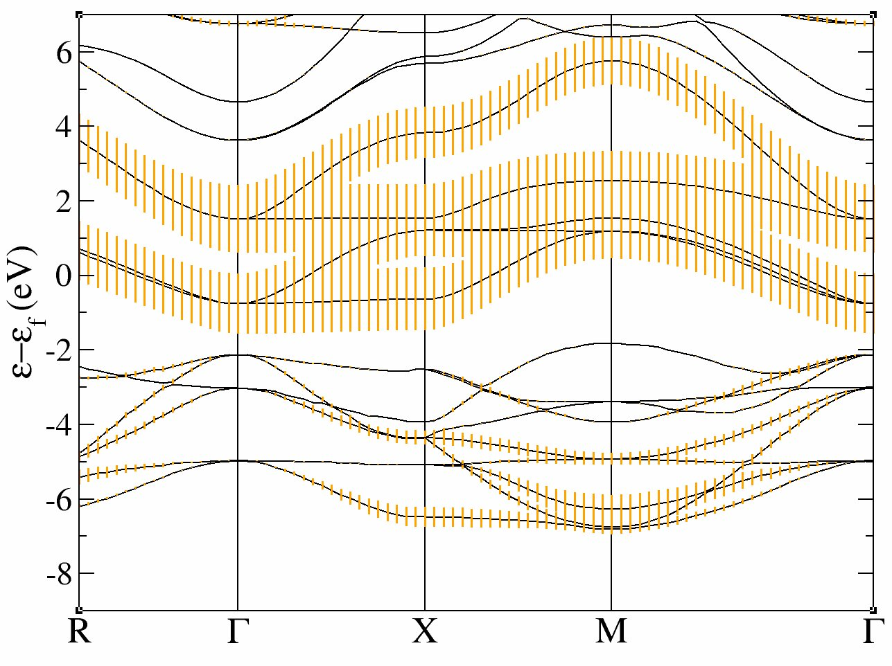
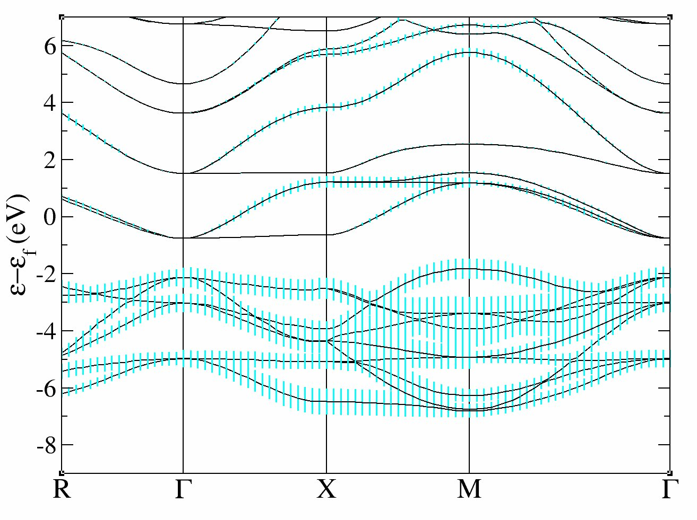
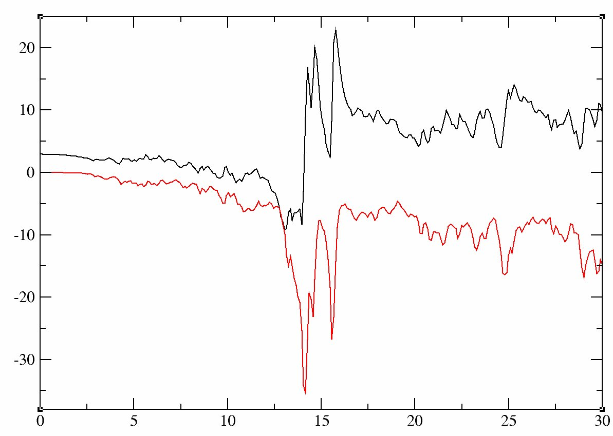

# Calculation of U and J using cRPA  

## Using the constrained RPA to compute the U and J in the case of SrVO<sub>3</sub>.  

This tutorial aims at showing how to perform a calculation of _U_ and _J_ in
Abinit using cRPA. This method is well adapted in particular to determine _U_
and _J_ as they can be used in DFT+DMFT. The implementation is described in [[cite:Amadon2014]].

It might be useful that you already know how to do PAW calculations using
ABINIT but it is not mandatory (you can follow the two tutorials on PAW in
ABINIT ([PAW1](paw1), [PAW2](paw2))).
The DFT+_U_ tutorial in ABINIT ([DFT+U](dftu)) might be useful to know some
basic variables about correlated orbitals.

The first GW tutorial in ABINIT ([GW](gw1)) is useful to learn how
to compute the screening, and how to converge the relevant parameters
(energy cutoffs and number of bands for the polarizability).

[TUTORIAL_README]

This tutorial should take two hours to complete (you should have access to more than 8 processors).

## 1 The cRPA method to compute effective interaction: summary and key parameters
  
The cRPA method aims at computing the effective interactions among correlated
electrons. Generally, these highly correlated materials contain rare-earth
metals or transition metals, which have partially filled _d_ or _f_ bands and
thus localized electrons. cRPA relies on the fact that screening processes can
be decomposed in two steps: Firstly, the bare Coulomb interaction is screened
by non correlated electrons to produce the effective interaction _W<sub>r</sub>_.

Secondly, correlated electrons screened this interaction to produce the fully
screening interaction _W_ [[cite:Aryasetiawan2004]]). However, the second
screening process is taken into account when one uses a method which describes
accurately the interaction among correlated electrons (such as Quantum Monte
Carlo within the DFT+DMFT method). So, to avoid a double counting of screening
by correlated electrons, the DFT+DMFT methods needs as an input the effective
interaction _W<sub>r</sub>_. The goal of this tutorial is to present the implementation
of this method using Projected Local Orbitals Wannier orbitals in ABINIT (The
implementation of cRPA in ABINIT is described in [[cite:Amadon2014]] and projected
local orbitals Wannier functions are presented in [[cite:Amadon2008]]). The
discussion about the localization of Wannier orbitals has some similarities
with the beginning on the DMFT tutorial (see [here](dmft.md#1) and [there](dmft.md#2))

Several parameters (both physical and technical) are important for the cRPA calculation:

  * **The definition of correlated orbitals.** The first part of the tutorial is similar to the DMFT tutorial
    and explains the electronic structure of SrVO<sub>3</sub> and will be used to understand the definition of
    Wannier orbitals with various extensions. Wannier functions are unitarily related to a selected
    set of Kohn Sham (KS) wavefunctions, specified in ABINIT by band index [[dmftbandi]], and [[dmftbandf]].
    Thus, as empty bands are necessary to build Wannier functions, it is required in DMFT or cRPA calculations
    that the KS Hamiltonian is correctly diagonalized: use high values for [[nnsclo]], and [[nline]]
    for cRPA and DMFT calculations and preceding DFT calculations. Another solution used in the present tutorial
    is to use a specific non self-consistent calculation to diagonalize the hamiltonian, as in _GW_ calculations.
    Concerning the localization or correlated orbitals, generally, the larger [[dmftbandf]]-[[dmftbandi]] is,
    the more localized is the radial part of the Wannier orbital. Finally, note that Wannier orbitals
    are used in DMFT and cRPA implementations but this is not the most usual choice of correlated orbitals 
    in the DFT+_U_ implementation in particular in ABINIT (see [[cite:Amadon2008a]]).
    The relation between the two expressions is briefly discussed in [[cite:Geneste2016]]. 

  * **The constrained polarization calculation.** As we will discuss in section  
    2, there are different ways to define the constrained polarizability, by suppressing in the polarization, 
    some electronic transitions: As discussed in section I of [[cite:Amadon2014]], one can either suppress 
    electronic transition inside a given subset of Kohn-Sham bands. In this case, one can use [[ucrpa]]=1, 
    and choose the first and last bands defining the subset of bands by using variable [[ucrpa_bands]]. 
    One can also use an energy windows instead of a number of bands by using [[ucrpa_window]]. 
    Another solution is to use a weighting scheme which lowers the contribution of a given transition, 
    as a function of the weight of correlated orbitals on the bands involved in the transition 
    (see Eq. (5) and (7) in [[cite:Amadon2014]]). In this case, on still use the variable [[ucrpa_bands]]. 
    The variable will in this case be used to define Projected Local Orbitals Wannier functions that will then 
    be used to define the weighting function in the polarizability. (see Eq. (5) and (7) in [[cite:Amadon2014]]). 

  * **Convergence parameters** are the same as for a polarizability calculation for the screening calculation 
    ([[ecuteps]], [[ecutwfn]], [[nband]]) and the same as for the exchange part of _GW_ for the effective interaction, 
    ie [[ecutsigx]], [[ecutwfn]]. It is recommended, as discussed in appendix A of [[cite:Amadon2014]], to use [[pawoptosc]]=1. 
    If the calculation is carried out with several atoms, use [[nsym]]=1, the calculation is not symmetrized 
    over atoms in this case. 

## 2 Electronic Structure of SrVO3 in LDA

*Before continuing, you might consider to work in a different subdirectory as
for the other tutorials. Why not Work_crpa?
In what follows, the name of files are mentioned as if you were in this subdirectory.
All the input files can be found in the `$ABI_TUTOPARAL/Input` directory.*

Copy the files *tucrpa_1.in* and *tucrpa_1.files* from *ABI_TUTOPARAL/Input* to *Work_crpa* with:

```sh
cd $ABI_TUTOPARAL/Input
mkdir Work_crpa
cd Work_crpa
cp ../tucrpa_1.files . 
cp ../tucrpa_1.in .
```

and run the code with:
    
    mpirun -n 32 abinit < tucrpa_1.files > log_1  &

This run should take some time. It is recommended that you use at least 10
processors (and 32 should be fast). It calculates the LDA ground state of
SrVO3 and compute the band structure in a second step. The variable
[[pawfatbnd]] allows to create files with "fatbands" (see description of the
variable in the list of variables): the width of the line along each k-point
path and for each band is proportional to the contribution of a given atomic
orbital on this particular Kohn Sham Wavefunction. A low cutoff and a small
number of k-points are used in order to speed up the calculation. During this
time you can take a look at the input file. 

There are two datasets. 
The first one is a ground state calculations with [[nnsclo]]=3 and [[nline]]=3 in order
to have well diagonalized eigenfunctions even for empty states. In practice,
you have however to check that the residue of wavefunctions is small at the
end of the calculation. In this calculation, we find 1.E-06, which is large
(1.E-10 would be better, so [[nline]] and [[nnsclo]] should be increased, but
it would take more time). When the calculation is finished, you can plot the
fatbands for Vanadium and *l=2* with
    
    xmgrace tucrpa_O_DS2_FATBANDS_at0001_V_is1_l0002 -par ../Input/tdmft_fatband.par

The band structure is given in eV.



and the fatbands for all Oxygen atoms and *l=1* with
     
    xmgrace tucrpa_O_DS2_FATBANDS_at0003_O_is1_l0001 tucrpa_O_DS2_FATBANDS_at0004_O_is1_l0001 tucrpa_O_DS2_FATBANDS_at0005_O_is1_l0001 -par ../Input/tdmft_fatband.par 



In these plots, you recover the band structure of SrVO3 (see for comparison
the band structure of Fig.3 of [[cite:Amadon2008]]), and the main character of the
bands. Bands 21 to 25 are mainly _d_ and bands 12 to 20 are mainly oxygen _p_.
However, we clearly see an important hybridization. The Fermi level (at 0 eV)
is in the middle of bands 21-23.

One can easily check that bands 21-23 are mainly _d-t<sub>2g</sub>_ and bands 24-25 are
mainly _e<sub>g</sub>_: just use [[pawfatbnd]] = 2 in *tucrpa_1.in* and relaunch the
calculations. Then the file *tucrpa_O_DS2_FATBANDS_at0001_V_is1_l2_m-2*,
*tucrpa_O_DS2_FATBANDS_at0001_V_is1_l2_m-1* and
*tucrpa_O_DS2_FATBANDS_at0001_V_is1_l2_m1* give you respectively the _xy_, _yz_ and
_xz_ fatbands (ie _d-t<sub>2g</sub>_) and *tucrpa_O_DS2_FATBANDS_at0001_V_is1_l2_m+0* and
*tucrpa_O_DS2_FATBANDS_at0001_V_is1_l2_m+2* give the _z<sup>2</sup>_ and _x<sup>2</sup>-y<sup>2</sup>_ fatbands
(ie _e<sub>g</sub>_).

So in conclusion of this study, the Kohn Sham bands which are mainly _t<sub>2g</sub>_
are the bands 21, 22 and 23.

Of course, it could have been anticipated from classical crystal field theory:
the vanadium is in the center of an octahedron of oxygen atoms, so _d_
orbitals are split in _t<sub>2g</sub>_ and _e<sub>g</sub>_. As _t<sub>2g</sub>_ orbitals are not directed
toward oxygen atoms, _t<sub>2g</sub>_-like bands are lower in energy and filled with one
electron, whereas _e<sub>g</sub>_-like bands are higher and empty.

In the next section, we will thus use the _d_ -like bands to built Wannier
functions and compute effective interactions for these orbitals.

## 3 Definition of screening and orbitals in cRPA: models, input file and log file
  
### 3.1. The constrained polarization calculation.

As discussed briefly in Appendix A of [[cite:Amadon2014]] as well as in section III
B of [[cite:Vaugier2012]] and Section II B of [[cite:Sakuma2013]], one can use different
schemes for the cRPA calculations. Let us discuss these different models
namely the ( _d-d_ ), ( _dp-dp_ ), ( _d-dp_ (a)), and ( _d-dp_ (b)) models.
In the notation (A-B), A and B refers respectively to some bands of A-like and
B-like character. Moreover, A refers to the definition of screening and B
refers to the definition of correlated orbitals. To clarify this definition,
we give below some examples:

  * ( ***t<sub>2g</sub>-t<sub>2g</sub>***) model (or _t<sub>2g</sub>_ model): The correlated orbitals are defined with only _t<sub>2g</sub>_-like bands (bands 21, 22 and 23). The screening inside these bands is not taken into account to built the constrained polarizability. Note that if this case (and in the ( _d-d_ ) and ( _dp-dp_ ) models), using [[ucrpa]]=1 or 2 give the same results, provided one uses [[ucrpa_bands]] equal to ([[dmftbandi]] [[dmftbandf]] ). 
  * ( ***d-d*** ) model (or d model): The correlated orbitals are defined with only _d_ -like bands (bands 21 to 25). The screening inside these bands is not taken into account. 
  * ( ***dp-dp*** ) model (or dp model): The correlated orbitals are defined with only _d_ -like and Op-like bands (bands 12 to 23). The screening inside these bands is not taken into account. 
  * ( ***d-dp (a)***) model: In this scheme the Wannier orbitals are constructed as in the ( _dp-dp_ ) model. However, in this scheme, one only supresses the screening inside _d_ -like bands ([[ucrpa]]=1). It is coherent with the fact that the DMFT will only be applied to the d orbitals: so the screening for Op-like bands need to be taken into account. 
  * ( ***d-dp (b)***) model: It is the same model as the ( _d-dp_ (a)), nevertheless, in this case, only the weighting scheme is used ([[ucrpa]]=2 in ABINIT). 
Which way of computing interactions is the most relevant depends on the way
the interactions will be used. Some aspects of it are discussed in Ref.
[[cite:Vaugier2012]]. Also, for Mott insulators, and if self-consistency over
interactions is carried out, the choice of models is discussed in [[cite:Amadon2014]].

### 3.2. The input file for cRPA calculation: correlated orbitals, Wannier functions

In this section, we will present the input variables and discuss how to
extract useful information in the log file in the case of the _d-d_ model. The
input file for a typical cRPA calculation (*tucrpa_2.in*) contains four datasets
(as usual _GW_ calculations, see the [GW tutorial](gw1.md#1a)): the
first one is a well converged LDA calculation, the second is non self-consistent calculation
to compute accurately full and empty states, the third
computes the constrained non interacting polarizability, and the fourth
computes effective interaction parameters _U_ and _J_. We discuss these four
datasets in the next four subsections.

Copy the files in your *Work_crpa* directory with:

```sh
cp ../tucrpa_2.in .
cp ../tucrpa_2.files 
```

The input file *tucrpa_2.in* contains standard data to perform a LDA
calculation on SrVO<sub>3</sub>. We focus in the next subsections on some peculiar input
variables related to the fact that we perform a cRPA calculation. Before
reading the following section, launch the abinit calculation:
    
    abinit < tucrpa_2.files > log_2

##### 3.2.1. The first DATASET: A converged LDA calculation

The first dataset is a simple calculation of the density using LDA using 50
bands. We do not use symmetry in this calculation, so [[nsym]]=1. If symmetry
is used ([[nsym]]=0), then the calculation of _U_ and _J_ will be valid, but
the full interaction matrix described in section 3.2.4 will not be correct.

##### 3.2.2. The second DATASET: A converged LDA calculation and definition of Wannier functions

Before presenting the input variables for this dataset, we discuss two
important physical parameters relevant to this dataset.

  * Diagonalization of Kohn-Sham Hamiltonian: As in the case of DFT+DMFT or _GW_ calculation, a cRPA calculation requires that the LDA is perfectly converged and the Kohn Sham eigenstates are precisely determined, including the empty states. Indeed these empty states are necessary both to build Wannier functions and to compute the polarizability. For this reason we choose a very low value of [[tolwfr]] in the input file tucrpa_1.in. 

  * Wannier functions: Once the calculation is converged, we compute Wannier functions, as in a DFT+DMFT calculation. To do this, we only precise that we are using the DFT+DMFT implementation (usedmft=0), but only with the Wannier keywords ([[dmftbandi]] and [[dmftbandf]]). We emphasize that with respect to the discussion on models on section 3.1, [[dmftbandi]] and [[dmftbandf]] are used to define the so called A bands. We will see in dataset 2 how B bands are defined. In our case, as we are in the _d-d_ model, we choose only the _d_ -like bands as a starting point and [[dmftbandi]] and [[dmftbandf]] are thus equal to the first and last _d_ -like bands, namely 21 and 25. 
    
```
    iscf2          -2    # Perform a non self-consistent calculation              
    nbandkss2      -1    # Number of bands in KSS file (-1 means the 
                         #   maximum possible) 
    kssform         3    # Format of the Wavefunction file (should be 3) 
    nbdbuf2         4    # The last four bands will not be perfectly 
                         # diagonalized 
    tolwfr2   1.0d-18    # The criterion to stop diagonalization 
    
    # Compute Wannier functions 
    usedmft2        1    # Mandatory to enable the calculation of Wannier 
                         #  functions as in DMFT. 
    dmftbandi2     21    # Precise the definition of Wannier functions 
    dmftbandf2     25    # Precise the definition of Wannier functions
```

##### 3.2.2. The third DATASET: Compute the constrained polarizability and dielectric function

The third DATASET drives the computation of the constrained polarizability and
the dielectric function. Again, we reproduce below the input variables
peculiar to this dataset.

We add some comments here on three most important topics

  * Definition of constrained polarizability: As in the discussion on models on section 3.1, the constrained polarizability is defined thanks to B-like bands. The keywords related to this definition is [[ucrpa_bands]]. According to the value of ucrpa, [[ucrpa_bands]] defined the bands for which the transitions are neglected, or (if ucrpa=2), it defined Wannier functions that are used in the weighting scheme (see Eq. (5) and (7) of section II of [[cite:Amadon2014]]). Alternatively and only if ucrpa=1, an energy windows can be defined (with variable [[ucrpa_window]]) to exclude the transition. In our case, as we are in the _d-d_ model, we neglect transitions inside the _d_ -like bands, so we choose [[ucrpa_bands]]= 21 25. 
  * Convergence of the polarizability: [[nband]] and [[ecuteps]] are the two main variables that should be converged. Note that one must study the role of these variables directly on the effective interaction parameters to determine their relevant values. 
  * Frequency mesh  of the polarizability: Can be useful if one wants to plot the frequency dependence of the effective interactions (as in e.g. [[cite:Amadon2014]]). 
    
```
optdriver3     3     # Keyword to launch the calculation of screening 
gwcalctyp3     2     # The screening will be used later with gwcalctyp 2
                     # in the next dataset 
getwfk3       -1     # Obtain WFK file from previous dataset
ecuteps3     5.0     # Cut-off energy of the planewave set to represent 
                     #   the dielectric matrix.
                     # It is important to converge effective interactions
                     #   as a function of this parameter.

# -- Frequencies for dielectric matrix
nfreqre3       1     # Number of  real frequencies 
freqremax3    10 eV  # Maximal value of frequencies 
freqremin3     0 eV  # Minimal value of frequencies 
nfreqim3       0     # Number of  imaginary frequencies 

# -- Ucrpa: screening
ucrpa_bands3  21 25  # Define the bands corresponding to the _d_ contribution 

# -- Parallelism
gwpara3        1
```

##### 3.2.3. The fourth DATASET: Compute the effective interactions

The fourth DATASET drives the computation of the effective interactions. It is
similar computationally to the computation of exchange in _GW_ calculations.
Again, we reproduce below the input variables peculiar to this dataset.

We add some comments on convergence properties

  * Convergence as the number of plane waves:  Eq. (A1) and (A2) in Appendix A of [[cite:Amadon2014]] 
    show the summation over plane waves which is performed. The cutoff on plane wave which is used 
    in this summation is [[ecutsigx]] because of the similarity of Eq. A2 with the Fock exchange 
    (see [[theory:mbt#evaluation_gw_sigma|GW notes]] when one computes the bare interaction. [[ecutsigx]] 
    is thus the main convergence parameter for this dataset. Note that as discussed in Appendix A of [[cite:Amadon2014]], 
    high values of [[ecutsigx]] can be necessary because oscillator matrix elements in PAW contains 
    the Fourier transform of (a product of) atomic orbitals. 

  * The frequency mesh  must be the same as in the DATASET 2. 
    
```
     optdriver4  4      # Self-Energy calculation
     gwcalctyp4  2      # activate HF or ucrpa
     getwfk4     1      # Obtain WFK file from dataset 1
     getscr4     2      # Obtain SCR file from previous dataset
     ecutsigx4  30.0    # Dimension of the G sum in Sigma_x.
    
     # -- Frequencies for effective interactions
     nfreqsp4    1
     freqspmax4 10 eV
     freqspmin4  0 eV
     nkptgw4     0      # number of k-point where to calculate 
                        # the GW correction: all BZ is used
     mqgrid4   300      # Reduced but fine at least for SrVO3
     mqgriddg4 300      # Reduced but fine at least for SrVO3
    
     # -- Parallelism
     gwpara4 2          # do not change if nsppol=2
```
    

#####  3.2.4 The cRPA calculation: the log file (for the _d-d_ model)

We are now going to browse quickly the log file for this calculation.

  * Bare interaction of atomic orbitals. 

First, at the beginning of the log file, you will find the calculation of the
bare interaction for the atomic wavefunction corresponding the angular
momentum specified by [[lpawu]], in the input file (here [[lpawu]] =2). It is
a simple fast direct integration. Note that this information is complete only
if you use XML PAW atomic data (as the one available on the JTH table
available on the ABINIT website).
    
```
      =======================================================================
      == Calculation of diagonal bare Coulomb interaction on ATOMIC orbitals
         (it is assumed that the wavefunction for the first reference
                 energy in PAW atomic data is an atomic eigenvalue)
    
     Max value of the radius in atomic data file   =    201.3994
     Max value of the mesh   in atomic data file   =    910
     PAW radius is                                 =      2.2000
     PAW value of the mesh for integration is      =    587
     Integral of atomic wavefunction until rpaw    =      0.8418
    
     For an atomic wfn truncated at rmax =    201.3994
         The norm of the wfn is                    =      1.0000
         The bare interaction (no renormalization) =     17.7996 eV
         The bare interaction (for a renorm. wfn ) =     17.7996 eV
    
     For an atomic wfn truncated at rmax =      2.2000
         The norm of the wfn is                    =      0.8418
         The bare interaction (no renormalization) =     16.0038 eV
         The bare interaction (for a renorm. wfn ) =     22.5848 eV
     =======================================================================
```
    
Various quantities are computed, the one which is interesting to see here, is
the bare interaction computed for a wavefunction truncated at a very large
radius (here 201.3994 au ), ie virtually infinite. We find that this bare
interaction is 17.8 eV. We will compare below this value to the bare
interaction computed on Wannier orbitals.

  * Bare Coulomb direct interaction of Wannier orbitals. In the third dataset, the code writes the Coulomb interaction matrix as: 
    
```
          U'=U(m1,m2,m1,m2) for the bare interaction
     -      1      2      3      4      5
       1 16.041 14.898 14.885 14.898 15.715
       2 14.898 16.041 15.508 14.898 15.092
       3 14.885 15.508 16.567 15.508 15.114
       4 14.898 14.898 15.508 16.041 15.092
       5 15.715 15.092 15.114 15.092 16.567
```
    

 * First we see that diagonal interactions are larger than off-diagonal terms, 
   which is logical, because electron interaction is larger if electrons are located in the same orbital. 
 * We recover in these interaction matrix the degeneracy of _d_ orbitals in the cubic symmetry 
   (we remind, as listed in [[dmatpawu]], that the order of orbitals in ABINIT are _xy_, _yz_, 
   _z<sup>2<\sup>_, _xy_, _x<sup>2</sup>-y<sup>2</sup>_). 
 * We note also that the interaction for _t<sub>2g</sub>_ and _e<sub>g</sub>_ orbitals are not the same. 
   This effect is compared in e.g. Appendix C.1 of [[cite:Vaugier2012]] to the usual 
   Slater parametrization of interaction matrices. 
 * Diagonal bare interactions are smaller to the bare interaction on atomic orbitals 
   (17.8 eV, as discussed above). It shows that the Wannier functions (obtained within the _d-d_ model) 
   are less localized than atomic orbitals. It is logical because these Wannier functions contain indeed 
   a weight on O- _p_ orbitals. 
 * From this interaction matrix, one can compute the average of all elements (the famous _U_ ),
   as well as the average of diagonal elements, which is sometimes used as another definition of _U_ 
   (see Eq. (8) and (9) of [[cite:Amadon2014]]. The two quantities are written in the log file:
 
```
    Hubbard bare interaction U=1/(2l+1)**2 \sum U(m1,m2,m1,m2)=   15.3789    0.0000

(Hubbard bare interaction U=1/(2l+1) \sum U(m1,m1,m1,m1)=   16.2514    0.0000)
```
    
!!! important

    To speed up the calculation and if one needs only these average values of _U_
    and _J_, one can use [[nsym]] = 0 in the input file, but in this case, the
    interaction matrix does not anymore reproduce the correct symmetry. For
    several correlated atoms, the implementation is under test and it is mandatory to use [[nsym]]=1.]

  * Bare exchange interaction. The exchange interaction matrix is also written as well 
    as the average of off-diagonal elements, which is _J_. 
    
```
       Hund coupling J=U(m1,m1,m2,m2) for the bare interaction
         1      2      3      4      5
    1 16.041  0.482  0.555  0.478  0.249
    2  0.482 16.041  0.329  0.478  0.478
    3  0.555  0.329 16.567  0.400  0.555
    4  0.478  0.478  0.400 16.041  0.482
    5  0.249  0.478  0.555  0.482 16.567
 
    bare interaction value of J=U-1/((2l+1)(2l)) \sum_{m1,m2} (U(m1,m2,m1,m2)-U(m1,m1,m2,m2))=    0.6667    0.0000
```
    

  * Then, the cRPA effective interactions are given for all frequency. 
     The first frequency is zero and the cRPA interactions are: 
    
```
     U'=U(m1,m2,m1,m2) for the cRPA interaction
       1      2      3      4      5
  1  3.434  2.432  2.338  2.432  2.966
  2  2.432  3.434  2.809  2.432  2.495
  3  2.338  2.809  3.641  2.809  2.430
  4  2.432  2.432  2.809  3.434  2.495
  5  2.966  2.495  2.430  2.495  3.641

 Hubbard cRPA interaction for w =  1, U=1/(2l+1)**2 \sum U(m1,m2,m1,m2)=    2.7546   -0.0000

 (Hubbard cRPA interaction for w =   1, U=1/(2l+1) \sum U(m1,m1,m1,m1)=    3.5167   -0.0000)

 Hund coupling J=U(m1,m1,m2,m2) for the cRPA interaction
       1      2      3      4      5
  1  3.434  0.440  0.508  0.435  0.247
  2  0.440  3.434  0.315  0.436  0.442
  3  0.508  0.315  3.641  0.378  0.444
  4  0.435  0.436  0.378  3.434  0.446
  5  0.247  0.442  0.444  0.446  3.641

  cRPA interaction value of J=U-1/((2l+1)(2l)) \sum_{m1,m2} (U(m1,m2,m1,m2)-U(m1,m2,m2,m1))=    0.5997    0.0000
```

  * At the end of the calculation, the value of _U_ and _J_ as a function of frequency are gathered. 
    
```
       -------------------------------------------------------------
                Average U and J as a function of frequency
       -------------------------------------------------------------
             omega           U(omega)            J(omega)
            0.000      2.7546   -0.0000      0.5997    0.0000
       -------------------------------------------------------------
```

## 4 Convergence studies

We give here the results of some convergence studies, than can be made by the
readers. Some are computationally expensive. It is recommanded to use at least
32 processors. Input files are provided in *tucrpa_3.in* and *tucrpa_3.files* for the first case.

### 4.1 Cutoff in energy for the polarisability [[ecuteps]]

The number of plane waves used in the calculation of the cRPA polarizability
is determined by [[ecuteps]] (see [[theory:mbt#RPA_Fourier_space|Notes on RPA calculations]]).
The convergence can be studied simply by increasing the values of [[ecuteps]] and gives:

<center>
    
[[ecuteps]] (Ha)|   _U_ (eV)  |   _J_ (eV)
------------|-----------|----------
   3        |    3.22   |    0.63
   5        |    3.01   |    0.60
   7        |    2.99   |    0.59
   9        |    2.99   |    0.58

</center>

So, for [[nband]]=30, [[ecutsigx]]=30 and a 4x4x4 k-point grid, the effective
interactions are converged with a precision of 0.02 eV for [[ecuteps]]=5.

### 4.2 Number of bands [[nband]]

The RPA polarizability depends also of the number of Kohn-Sham bands as also
discussed in the [[theory:mbt#RPA_Fourier_space|Notes on RPA calculations]])

<center>
    
[[nband]]    |      _U_ (eV)  |   _J_ (eV)
---------|--------------|---------
 30      |       3.01   |    0.61
 50      |       2.75   |    0.60
 70      |       2.71   |    0.59
 90      |       2.70   |    0.59

</center>
    
So, for [[ecuteps]]=5, [[ecutsigx]]=30 and a 4x4x4 k-point grid, the effective
interactions are converged with a precision of 0.05 eV for [[nband]]=50.

### 4.3 Cutoff in energy for the calculation of the Coulomb interaction [[ecutsigx]]

[[ecutsigx]] is the input variable determining the number of plane waves used
in the calculation of the exchange part of the self-energy. The same variable
is used here to determine the number of plane waves used in the calculation of
the effective interaction. The study of the convergence gives:
    
<center>
    
[[ecutsigx]] (Ha)     |       _U_<sub>bare</sub> (eV) |   _J_<sub>bare</sub> (eV)  |    _U_ (eV)   |    _J_ (eV)
------------------|-------------------|----------------|-------------|------------
    30            |        15.38      |    0.67        |    3.22     |    0.63
    50            |        15.38      |    0.68        |    3.22     |    0.65
    70            |        15.38      |    0.69        |    3.22     |    0.66

</center>

For [[ecuteps]]=3, [[nband]]=30 and a 4 4 4 k-point grid, effective
interactions are converged with a precision of 0.02 eV for [[ecutsigx]]=30 Ha.

### 4.4 k-point

The dependence of effective interactions with the k-point grid is also important to check.
    
<center>
    
kpoint grid |    _U_<sub>bare</sub> (eV)|    _J_<sub>bare</sub> (eV) |    _U_ (eV)   |    _J_ (eV)
------------|---------------|----------------|-------------|-------------
   4 4 4    |      15.38    |      0.65      |     3.22    |     0.63
   6 6 6    |      15.36    |      0.66      |     3.18    |     0.62
    
</center>

For [[ecuteps]]=3, [[nband]]=30 and [[ecutsigx]]=30, effective interactions
are converged to 0.01 eV for a k-point grid of 6 6 6. The converged parameters
are thus [[ecuteps]]=5,[[ecutsigx]]=30,ngkpt=6 6 6, [[nband]]=50 with an
expected precision of 0.1 eV. We will use instead
[[ecuteps]]=5,[[ecutsigx]]=30,ngkpt=4 4 4, [[nband]]=50 to lower the
computational cost. In this case, we find values of _U_ and _J_ of 2.75 eV and
0.41 eV and _U_ is probably underestimated by 0.1 eV.

## 5 Effective interactions for different models

  
In this section, we compute, using the converged values of parameters, the
value of effective interactions for the models discussed in section and 3.1.
The table below gives for each model, the values of [[dmftbandi]],
[[dmftbandf]] and [[ucrpa_bands]] that must be used, and it sums up the value
of bare and effective interactions.

<center>

model                | _d - d_ |   _t<sub>2g</sub>-t<sub>2g</sub>_  |_dp-dp_  |  _d -dp_ (a) |  _d -dp_ (b)
---------------------|---------|--------------|---------|--------------|--------------- 
[[ucrpa]]                |    1    |     1        |    1    |     1        |     2
[[dmftbandi]]/[[dmftbandf]]  |   21/25 |    21/25     |    12/25|    12/25     |    12/25
[[ucrpa_bands]]          |   21 25 |    21 25     |    12 25|    21 25     |    12 25 
_U_<sub>bare</sub> (eV)       |   15.4  |    15.3      |    19.4 |    19.4      |    19.4
_U_<sub>bare diag</sub> (eV) |   16.3  |    16.0      |    20.6 |    20.6      |    20.6 
_J_<sub>bare</sub> (eV)     |   0.66  |    0.54      |   0.96  |    0.96      |    0.96   
_U_ (eV)                 |   2.8   |    2.8       |    10.8 |    3.4       |    1.6
_U_<sub>diag</sub> (eV)      |   3.5   |    3.4       |    12.0 |    4.4       |    2.6
_J_ (eV)                 |   0.60  |    0.47      |     0.91|    0.87      |    0.86


</center>

Even if our calculation is not perfectly converged with respect to k-points,
the results obtained for the _d-d_, _dp-dp_, and _d-dp_ (a) models are in
agreement (within 0.1 or 0.2 eV) with results obtained in Table V of
[[cite:Amadon2014]] and references cited in this table.

To obtain the results with only the _t<sub>2g</sub>_ orbitals, one must use a specific
input file, which is tucrpa_4.in, which uses specific keywords, peculiar to
this case (compare it with tucrpa_2.in). In this peculiar case, the most
common definition of J has to be deduced by direct calculation from the
interaction matrices using the Slater Kanamori expression (see e.g.
[[cite:Lechermann2006]] or [[cite:Vaugier2012]]) and not using the value of _J_ computed in the code).

We now briefly comment the physics of the results.

* Bare interactions. When the number of bands used is larger, the Wannier orbitals extension is smaller. 
  Thus, the interaction obtained with Wannier functions obtained from _dp_ bands are larger 
  than interactions obtained with Wannier functions obtained with _d_ bands and also larger 
  than interaction obtained on atomic orbitals. 

* For the same Wannier functions ( _dp-dp, d-dp_ (a), _d-dp_ (b)), one can see the role of 
  the screening on cRPA interactions:

      - When one supresses all transitions inside the _d_ -like and _p_ -like bands ( _dp-dp_ model), _U_ is large.
      - When only the transitions inside the _d_ -like bands are suppressed, _U_ is smaller ( _d-dp_ (a) model)
        in comparison to the _dp-dp_ model, because the screening is more efficient.
      - Lastly, when one uses the weighting scheme to compute the polarizability, _U_ is very small.
        Indeed, in this case, one can show that there are some residual transitions near the Fermi level
        (due to the hybridization between _d_ orbitals and O _p_ orbitals) which are very efficient
        to screen the interaction (A similar effect is discussed in [[cite:Amadon2014]] for UO 2 or
        [[cite:Sakuma2013]] for transition metal oxydes).

Finally, fully screened interactions (not discussed here) could also be
computed for each definition of correlated orbitals by using the default
values of [[ucrpa_bands]].

## 6 Frequency dependent interactions
  
In this section, we are going to compute frequency dependent effective
interactions. Just change the following input variables in order to compute
effective interaction between 0 and 30 eV. We use [[nsym]] = 0 in order to
decrease the computational cost.
    
     # -- Frequencies for effective interactions
     nsym        0
     nfreqsp3   60
     freqspmax3 30 eV
     freqspmin3  0 eV
     nfreqsp4   60
     freqspmax4 30 eV
     freqspmin4  0 eV

An example of input file can be found in *tucrpa_5.in*. Note that we have
decreased some parameters to speed-up the calculations. Importantly, however,
we have increased the number of Kohn Sham bands, because calculation of
screening at high frequency involves high energy transitions which requires
high energy states (as well as semicore states). If the calculation is too
time consuming, you can reduce the number of frequencies. The following figure
has been plotted with 300 frequencies, but using 30 or 60 frequencies is
sufficient to see the main tendencies. Extract the value of _U_ for the 60 frequencies using:
    
    grep "U(omega)" -A 60 tucrpa_5.out > Ufreq.dat

Remove the first line, and plot the data:



We recover in the picture the main results found in the Fig. 3 of [[cite:Aryasetiawan2006]]. 
Indeed, the frequency dependent effective interactions exhibits a plasmon excitation.

## 7 Conclusion
  
This tutorial showed how to compute effective interactions for SrVO3. It
emphasized the importance of the definition of correlated orbitals and the
definition of constrained polarizability.
