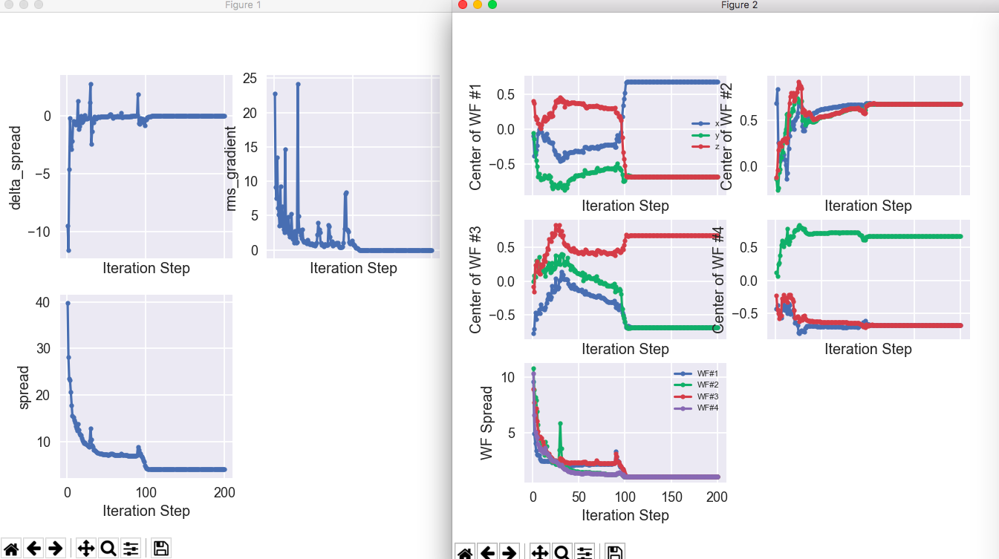
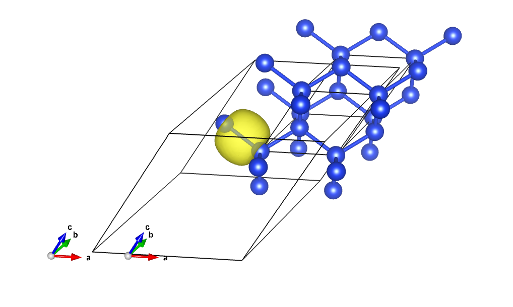
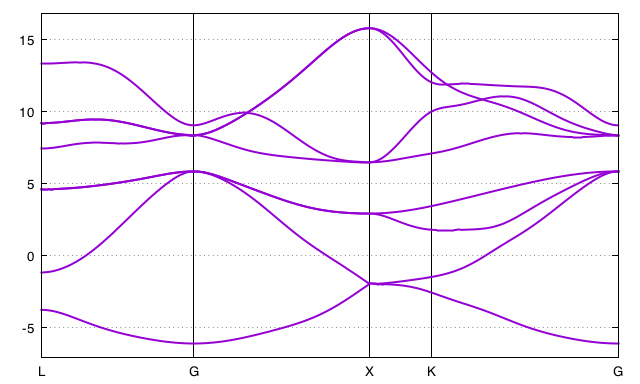

# Tutorial on the use of Wannier90 library

## The Wannier90 interface tutorial

This tutorial aims at showing how to use the Wannier90 interface to compute
Maximally Localized Wannier Functions (MLWFs).

You will learn how to get MLWFs with ABINIT and Wannier90 and what are the
basic variables to govern the numerical efficiency.

This tutorial should take about 1 hour and it is important to note that the examples in this tutorial
are not converged, they are just examples to show how to use the code.

[TUTORIAL_READMEV9]

## Summary of Wannier90 in ABINIT

Wannier90 is a code that computes MLWFs (see [www.wannier.org](http://www.wannier.org) ).
Wannier90 uses the methodology introduced by N. Marzari and D. Vanderbilt in 1997 and it is
highly recommended to read the following papers to understand its basics:
[[cite:Marzari1997]] and [[cite:Souza2002a]].

Wannier functions (WFs) can be obtained from Bloch states by means of the formulas 1-3 of [[cite:Souza2002a]].
As you may note there is a freedom of choice in the Bloch orbital's phase which is reflected
in the shape and the spatial extent of the WF.
This means that for different phases there will be WFs with different spatial localizations.

To obtain the MLWFs we minimize the spread of the WF with respect to the choice of phase.
This is done by using a steepest-descent algorithm, see section D of [[cite:Marzari1997]].
After a ground state calculation the Wannier90 code will obtain the MLWFs
requiring just two ingredients:

* The overlaps $M_{mn} = \langle u_{mk} | u_{nk+b} \rangle$ between the cell periodic part
  of the Bloch states $|u_{nk}\rangle$. See Eq. 25 of [[cite:Marzari1997]]).

* As a starting guess the projection, $A_{mn} = \langle \psi_{mk} | g_{n} \rangle$,
  of the Bloch states $|\psi_{nk} \rangle$ onto trial
  localized orbitals $|g_{n}\rangle$ (See section D of [[cite:Souza2002a]])

What ABINIT does is to take the Bloch functions from a ground state calculation
and compute these two ingredients. Then, Wannier90 is executed. Wannier90 is
included as a library in ABINIT and the process is automatic, so that in a
single run you can do both the ground state calculation and the computation of MLWFs.

## A first example: silicon

Before starting make sure that you compiled abinit enabling Wannier90.
You may have to recompile the code with

```
configure --with-config-file=myconf.ac
```

where *myconf.ac* defines:

```sh
# Flavor of the DFT library to use (default is atompaw+bigdft+libxc+wannier90)

with_dft_flavor="wannier90"

# Include flags for the Wannier90 library (default is unset)
#
#with_wannier90_incs="-I/usr/local/include/wannier90"

# Link flags for the Wannier90 library (default is unset)
#
#with_wannier90_libs="-L${HOME}/lib/wannier90 -lwannier90"
```

Now we will compute a set of MLWFs for silicon.
We are going to extract the Wannier functions corresponding to the four valence states of silicon.

*Before beginning, you might consider to work in a different sub-directory as
for the other tutorials. Why not Work_w90?*
Then copy the files file *tw90_1.files*, *tw90_1.in* and *wannier90.win* from
the *$ABI_TESTS/tutoplugs/Input* directory to *Work_w90*:

    cd $ABI_TESTS/tutoplugs/Input
    mkdir Work_w90
    cd Work_w90
    cp ../tw90_1.files .
    cp ../tw90_1.in .

Wannier90 also uses a secondary input file called *wannier90.win*.
Therefore, you must include this file in the folder:

    cp ../wannier90.win .

Now you are ready to run abinit. Please type in:

    abinit < tw90_1.files > log 2> err &

Let's examine the input file *tw90_1.in*, while the calculation is running.



The input file should look familiar to you. It is indeed the primitive cell of silicon.
It has two data sets: first a SCF calculation and then a NSCF calculation which
will call the Wannier90 library. The only new input variable is [[prtwant]]
which has to be set to 2 in order to use the Wannier90 utility.

Now lets look at the second input file *wannier90.win*.



This is a mandatory input file required by the Wannier90 library.
There are many variables that can be defined inside this file.
In our case we used **num_wann** and **num_iter**.
These variables are used in the minimization of the spread
to obtain the MLWF. In particular, **num_wann** defines the number of Wannier
functions to extract while **num_iter** sets the maximum number of iterations. There
are also variables to govern the disentanglement procedure outlined in [[cite:Souza2002a]]
which are not used in this simple case. The complete list of input variables
can be found in the Wannier90 user guide (see [www.wannier.org](http://www.wannier.org)).

We can now examine the log file. After the convergence of the SCF cycle is
reached. We can see that the Wannier90 library is called. You will find the following lines:

      Calculation of overlap and call to Wannier90 library
      to obtain Maximally Localized Wannier functions
      - wannier90.win is a mandatory secondary input
      - wannier90.wout is the output for the library
      - wannier90.amn contains projections
      - wannier90random.amn contains random projections
      - wannier90.mmn contains the overlap
      - wannier90.eig contains the eigenvalues

This is an explanation of the input and output files for the Wannier90
library. As you can see many new files were created. The input files for
Wannier90 which were created by ABINIT are:

**wannier90random.amn**
:   Contains a list of projections to be used as a starting guess of the WF.
    This is the $A_{mn}$ matrix which was mentioned before in this tutorial.

**wannier90.eig**
:   Contains a list of eigenvalues for each k-point and band.

**wannier90.mmn**
:   Contains the overlaps between the cell periodic part of the Bloch states.
    This is the M_mn matrix mentioned before in this tutorial.

**UNK**
:   Files containing the wavefunction in real space for every k-point.
    Once these files were computed by ABINIT the Wannier90 library was used.
    The output files of Wannier90 are:

**wannier90.wout**
:   This is the main output file of the library.
    You should read it carefully to see the details of the calculation.

**wannier90.chk**
:   This file is required to restart a calculation is case you use Wannier90 in standalone mode.
    In our case it is not used.

To obtain information about the steepest-descent minimization just issue:

    grep CONV tw90_1o_DS2_w90.wout

You will obtain a table of the following form:

     +--------------------------------------------------------------------+<-- CONV
     | Iter  Delta Spread     RMS Gradient      Spread (Ang^2)      Time  |<-- CONV
     +--------------------------------------------------------------------+<-- CONV
          0     0.492E+02     0.0000000000       49.1838608828       0.09  <-- CONV
          1    -0.947E+01    22.7791321117       39.7138163954       0.09  <-- CONV

You can verify that the final spread you get is around 4.0 Å$^2$.

Similarly to obtain information about the disentanglement procedure (not used in this example)
just type:

    grep DIS wannier90.wout

You will obtain a table of the following form:

     +---------------------------------------------------------------------+<-- DIS
     |  Iter     Omega_I(i-1)      Omega_I(i)      Delta (frac.)    Time   |<-- DIS
     +---------------------------------------------------------------------+<-- DIS

!!! tip

    If |AbiPy| is installed on your machine, you can use the |abiopen| script
    with the `wout` command and the `--expose` option to visualize the iterations

        abiopen.py tw90_1o_DS2_w90.wout --expose -sns

    


### Visualize the Wannier functions

You can see the Wannier functions in |xcrysden| format. Just type:

    xcrysden --xsf tw90_1o_DS2_w90_00001.xsf

To see the isosurface click on: Tools->Data Grid -> OK
And modify the isovalue, put, for instance, 0.3 and check the option "Render +/- isovalue" then click on OK
Alternatively, one can read the xsf file with |vesta|.
MacOsx users can use the command line:

    open tw90_1o_DS2_w90_00003.xsf -a vesta

to invoke vesta directly from the terminal:




!!! important

    * It is important to set [[istwfk]] equal to 1 for every k-point avoiding using symmetries.
      The reason is that the formalism used to extract the MLWF assumes that you have a uniform grid of k-points.
      See section IV of [[cite:Marzari1997]].

    * The number of Wannier functions to extract should be minor or equal to the number of bands.
      If _nband > nwan_ then the disentanglement routines will be called.

    * The number of k-points should be equal to ngkpt(1)*ngkpt(2)*ngkpt(3).
      This is achieved by using the input variables [[kptopt]]= 3, [[ngkpt]] and [[nshiftk]]= 1.

    * The prefix of all wannier90 files in this sample case is _wannier90_.
      Other possible prefixes are w90_ and **abo** __w90_ , where **abo** is the fourth line on your .file file.
      To setup the prefix, ABINIT will first look for a file named **abo**
      __w90.win_ if it is not found then it will look for _w90.win_ and finally for _wannier90.win_.

## The PAW case

Before starting it is assumed that you have already completed the tutorials [PAW1](paw1) and [PAW2](paw2).

For silicon, we just have to add the variable [[pawecutdg]] and the PAW Atomic Data is included in the pseudopotential file.
An example has already been prepared.

Just copy the files *tw90_2.files* and *tw90_2.in* into *Work_w90*:

    cp ../tw90_2.files .
    cp ../tw90_2.in .

We are going to reuse the wannier90.win of the previous example.
Now, just run abinit again

    abinit < tw90_2.files > log 2> err &

As it is expected, the results should be similar than those of the PW case.

!!! important

    For the PAW case the UNK files are not those of the real
    wavefunctions. The contribution inside the spheres is not computed, however,
    they can be used to plot the Wannier functions.

## Defining the initial projections

Up to now we have obtained the MLWF for the four valence bands of silicon. It
is important to note that for valence states the MLWF can be obtained starting
from a random initial position. However, for conduction states we have to give
a very accurate starting guess to get the MLWF.

We are going to extract the $sp^3$ hybrid orbitals of Silane SiH$_4$. You can start
by copying from the tests/tutoplugs directory the following files:

    cp ../tw90_3.files .
    cp ../tw90_3.in .
    cp ../tw90_3o_DS2_w90.win .

Now run abinit

    abinit < tw90_3.files > log 2> err &

While it is running, we can start to examine the input files.
Open the main input file *tw90_3.in*. The file is divided into three datasets.



First a SCF calculation is done. What follows is a NSCF calculation including
more bands. Finally, in the third dataset we just read the wavefunction from
the previous one and the Wannier90 library is called. **w90iniprj** is a keyword
used to indicate that the initial projections will be given in the **.win** file.

!!! note

    You may notice that the **.win** file is now called *tw90_3o_DS2_w90.win*.
    It has the following form: *prefix_dataset_w90.win*, where the prefix is taken from
    the third line of your .file file. and dataset is the dataset number
    at which you call Wannier90 (dataset 2 in this example).

Now open the **.win** file. The initial projections will be the $sp^3$ hybrid
orbitals centered in the position of the silicon atom.
This is written explicitly as:

    begin projections
    Si:sp3
    end projections

There is an enormous freedom of choice for the initial projections. For
instance, you can define the centers in Cartesian coordinates or rotate the
axis. Please refer to the Wannier90 user guide and see the part related to
projections (see [www.wannier90.org](http://www.wannier.org)).

## More on Wannier90 + ABINIT

Now we will redo the silicon case but defining different initial projections.

This calculation will be more time consuming, so you can start by running the
calculation while reading:

    cp ../tw90_4.in .
    cp ../tw90_4.files .
    cp ../tw90_4o_DS3_w90.win .

**Initial projections:**

In this example we extract sp$^3$ orbitals centered on the silicon atoms. But you
could also extract bonding and anti-bonding orbitals by uncommenting and
commenting the required lines as it is indicated in *tw90_4o_DS3_w90.win*.

You can see that we are using **r=4** in the initial projections block. This
is to indicate that the radial part will be a Gaussian function whose width
can be controlled by the value of the variable **zona**. The main advantage over
radial functions in the form of hydrogenic orbitals is that the time to write
the .amn file will be reduced.

**Interpolated band structure**

We are going to run Wannier90 in standalone mode. Just comment out the first
two lines of the **.win** file:

    postproc_setup = .true.   !used to write .nnkp file at first run
    num_iter = 100
    wannier_plot = .true.
    wannier_plot_supercell = 3

And uncomment the following two lines:

    !restart = plot
    !bands_plot = .true.

Now run Wannier90:

    $ABI_HOME/fallbacks/exports/bin/wannier90.x-abinit tw90_4o_DS3_w90

The interpolated band structure is in *tw90_4o_DS3_w90_band.dat*

To plot the bands, open |gnuplot| in the terminal and type:

```gnuplot
load "tw90_4o_DS3_w90_band.gnu"
```



