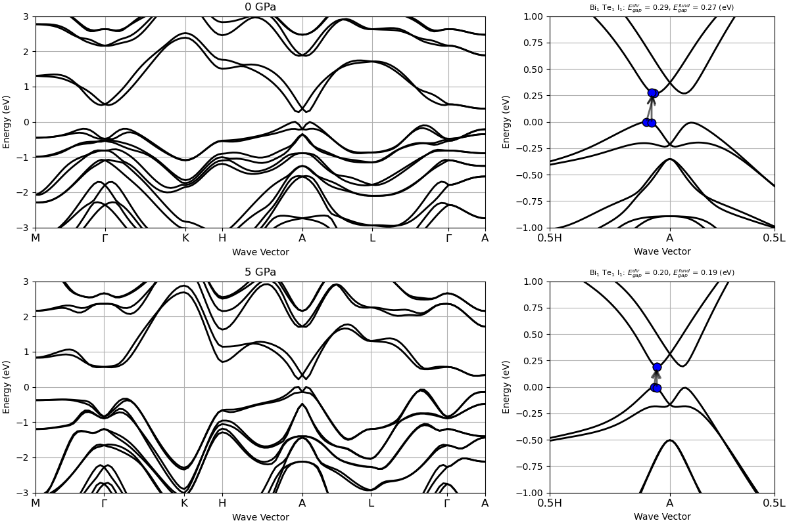

# Z2Pack postprocessor

## The Z2Pack interface tutorial

This tutorial aims at showing how to use the
[Z2Pack](https://z2pack.greschd.ch/en/latest/index.html) application
with an interface to ABINIT, to compute
the Z2 topological invariant and find topologically non-trivial insulators.

You will learn how to use Wannier90 and Z2Pack to follow Wannier charge centers
which allow to compute the Z2 topological invariant.
You will be reproducing some of the results obtained in [[cite:Brousseau-Couture2020]],
where it it shown that BiTeI is a trivial insulator at 0GPa but undergoes a transition
to a non-trivial insulating phase under isotropic pressure. At 5GPa, the material is
a non-trivial topological insulator.

You already should know about the interface between ABINIT and Wannier90 
(see the tutorial [Wannier90](/tutorial/wannier90)).
This tutorial should take about 1 hour. It is important to note that the examples in this tutorial
are not converged, they are just examples to show how to use the code.

[TUTORIAL_README]

## 1. Summary of Z2Pack in ABINIT

Z2Pack is a code that enables the calculation of topological invariants from model 
Hamiltonians, as well as from first-principles calculations.
It is highly recommended to read the following papers to understand its basics:
[[cite:Gresch2017]] and [[cite:Gresch2018]].

Z2Pack starts from a one-particle Hamiltonian $H(\textbf{k})$  which describes the electronic states in a crystalline material.
Its eigenvectors are so-called *Bloch states* $| \psi_{n,\textbf{k}} \rangle$. 
They are superpositions of plane waves with wave vector $\textbf{k}$.
Bloch states can be written as $| \psi_{n, \textbf{k}} \rangle = e^{i\textbf{k} \cdot \textbf{r}} | u_{n, \textbf{k}} \rangle$
where $|u_{n, \textbf{k}} \rangle$ is cell-periodic.
Taking into account the shape of the Bloch states leads to a topological classification of materials.

The topological classification of materials is based on a topological invariant called the Chern number.
For a closed, orientable two-dimensional surface $S$ in reciprocal space, the Chern number invariant $C$
can be defined in terms of the cell-periodic states in a set $B$ of bands as 
$C = \frac{i}{2\pi} \sum_{n\in B}  \int_S \nabla_{\textbf{k}} \wedge \langle u_{n, \textbf{k}} | \nabla_{\textbf{k}} | u_{n, \textbf{k}} \rangle \cdot d\textbf{S}$.

There are various ways to calculate the Chern number that are easier numerically.
One involves dividing the surface $S$ into small segments, which correspond to calculating the Berry phase for closed loops in the Brillouin zone.
These can then be expressed as Wilson loops, for which the eigenvalues are connected to the total Berry phase.

Another approach used by Z2Pack is to compute the so-called Wannier charge centers,
which is based on the notion of Wannier orbitals.
These are given by Fourier transforming the Bloch states
$|\textbf{R}n\rangle = \frac{V}{(2\pi)^d} \int_{BZ} e^{-i\textbf{k} \cdot \textbf{R}} | \psi_{n, \textbf{k}} \rangle d\textbf{k}$ where $d$ is the dimensionality of the system and $V$ the unit cell volume.
These orbitals can be changed by a Gauge transformation which affects their localization and position in real space.
To compute topological invariants, hybrid Wannier orbitals are introduced: they are Fourier transforms performed only in one spatial direction, for example $|\textbf{R}_x, k_y, k_z; n \rangle = \frac{a_x}{2\pi} \int^{\pi/a_x}_{-\pi/ax} e^{-ik_xR_x} | \psi_{n \textbf{k}} \rangle$.

The average position of such orbital depend on the remaining reciprocal space variables:
$\bar{x}_n(k_y, k_z) = \langle 0, k_y, k_z; n | \hat{x} | 0, k_y, k_z; n\rangle.$
This quantity is called the hybrid Wannier charge center and it is directly related to the Berry phase as
$C = \frac{1}{a} \sum_n \bar{x}_n$.
This procedure of segmenting the surface is illustrated in [[cite:Gresch2018]] Figure 6.

The equivalence between hybrid Wannier charge centers and the Berry phase gives rise to a physical interpretation of the Chern number as a charge pumping process, where each cycle of $k_x$ moves the charge by $C$ unit cells.

For time-reversal invariant systems, the total Chern number is zero as 
the Chern numbers of Kramers partners cancel each other.
We will rather compute the Z2 invariant, which can only take values of 0 or 1.
Z2Pack can handle this calculation in the following way.
By fixing one reciprocal space coordinate at a time-reversal invariant value
(i.e. $k_i=0$ or $k_i=0.5$ in reduced coordinates), we can define a surface in 
reciprocal space which contains its own time-reversal image.
Using the hybrid Wannier charge centers computed on this surface, we can
then define a surface invariant $\Delta\in\{0,1\}$, which can be intuitively
understood as the Chern number mod 2 of one subset of Kramers partners.
More details about how Z2Pack handles this calculation will be provided later.

To compute the surface invariant $\Delta$, Z2pack needs 2 inputs: a description
of the system and the surface on which the invariant should be calculated.
In the interface with ABINIT, Z2Pack will start from a computed ground state and 
perform the Wannierization on lines in the Brillouin zone.
At the end, it can sum mod 2 the surface invariants obtained on the two 
time-reversal invariant surfaces to evaluate the Z2 invariant.

Before we actually compute the Z2 invariant, we will take a look at another indication of non-trivial topology: band inversion.

## 2. Pressure dependent band inversion in BiTeI

Before beginning, you might consider working in a different sub-directory as for the other tutorials.
Follow these instructions which take you to the right folder, create a subfolder called *Work_z2pack* and
copy the first calculation:

    cd $ABI_TESTS/tutoplugs/Input
    mkdir Work_z2pack && cd Work_z2pack
    cp ../tz2_2.abi .

You are now ready to run abinit by using (here for four cores - other number of cores or sequential runs are possible as well) :

    mpirun -n 4 abinit tz2_2.abi > log 2> err &

Let us examine the input file *tz2_2.abi*, while the calculation is running:.



This input file should look familiar, as it involves features of ABINIT that you probably already used.
It is constructed into two loops of three datasets.
The first big loop uses the system at 0 GPa while the second is performed at 5 GPa.
In each of these big loops, the first computation calculates the ground state on a coarse grid,
the second one computes the band structure along high-symmetry paths in the entire Brillouin zone
and the third one is the calculation of fatbands which outputs the orbital character of the different bands, only along a specific path.

Let us compare the band structure. We use a small python script based on abipy:



Run it using:

    python ../tz2_2_bandstructure.py

You should get a less resolved version of the following figure:

 

The path of this band structure is first along a high-symmetry path in the $k_z=0$ plane
$(M-\Gamma-K)$.
Then is goes out of plane to the $k_z=\pi/c$ plane ($K$-$H$).
It then goes in along the same path as in the $k_z=0$ plane, but translated to the $k_z=\pi/c$ one ($H$-$A$-$L$).

At first glance, the two figures in the right column look very similar, as they are both gapped.
The band gap energy is slightly smaller at 5 GPa compared to the 0 GPa value,
which seems to indicate that the band gap of BiTeI closes with increasing pressure.
However, if we compute the pressure dependence of the band gap energy between these two pressures,
we will observe that the band gap decreases up to P\sim 2 GPa (and almost vanishes),
then starts to \textit{increase} as pressure is further increased (see Figure 4 of [[cite:Brousseau-Couture2020]]).
Knowing that a topological phase transition must be accompanied by a closing of the band gap,
this behavior suggests that one of those pressures might have a non-trivial topology.
If this is the case, the electronic bands in the non-trivial phase would display a band inversion.

Around the $A$ point, one can notice some band dispersions characteristic of band inversion.
In order to check whether or not there is inversion of character between bands which are gapped due to spin-orbit coupling,
we plot the fatbands.
One can use the fatbands plotting feature of abipy as used in the [Wannier90](/tutorial/wannier90) tutorial,
but instead here we will use a more advanced script which plots the difference in character between
the p orbitals of bismuth and of those of both the tellurium and iodine.
This procedure makes more clear the band inversion and the script is the following:



    cp -r ../input_tz2_3/ .
    python ../tz2_2_relative_projection.py

which produces a less converged version of this figure:

At 0 GPa, there is no band inversion while at 5 GPa, there is one around the $A$ point.
We thus suspect that there is a non-trivial Z2 invariant for this material,
that we will now compute using Z2Pack.

## 3. Computing the Z2 invariant using Z2Pack

You need first to install Z2Pack, if not yet available on your computer.
Please, see [Z2Pack home](https://z2pack.greschd.ch/en/latest/index.html), or directly
the [Installation and setup information](https://z2pack.greschd.ch/en/latest/tutorial/installation.html).

Then, to run the example presented in this section, you need to download four big files from GitHub, 
<https://github.com/abinit/abinit_assets/tree/main/tests/tutoplugs/Input/results_tz2_3> ,
and store them in the directory results_tz2_3, such that

    ls results_tz2_3
    BiTeI_0.msgpack  BiTeI_1.msgpack  BiTeI_2.msgpack  BiTeI_3.msgpack 
 
You will now launch the script for ABINIT with Z2Pack:

    cp -r ../input_tz2_3/ .
    python ../z2.py

given by the following file:



It works as follow:

* We define the system using z2pack.fp.System().

* We define the surfaces for which the invariant is computed using z2pack.surface.run.
We need two time-reversal invariant planes, in this case the $k_z=0$ and $k_z=\pi/c$ planes.
This function also runs the calculation. It will create a directory where for each new line on the
surface, corresponding to different points in the x
direction, a computation using ABINIT+Wannier90 is performed.
This data is preserved and if you want to add a line, you can use the argument load=True which will restart the calculation
and perform only the lines that were not already done.
This is what is done in this tutorial, as in order for this calculation to be sufficiently converged, it takes too much time.

* The surface invariant is stored in the z2pack.invariant.z2 variable.

The script delivers:

    for 0 GPa:
    z2 topological invariant at kz = 0.0: 0
    z2 topological invariant at kz = 0.5: 0
    for 5 GPa:
    z2 topological invariant at kz = 0.0: 0
    z2 topological invariant at kz = 0.5: 1

which informs us that at 0 GPa, the system is a trivial insulator, while at 5 GPa, it is topologically non-trivial.

We included a script that helps visualize the trajectories of the Wannier charge centers. Run it like this:

    python ../tz2_3_hwcc.py

You will find the following figure:

In this figure each open circle represents a hybrid Wannier charge center (HWCC).
The left column is calculated in the $k_z=0$ plane and the right column in the $k_z=0.5$ plane.
The HWCC form "bands", similar to the band structure of a dispersion relation,
but the values are defined mod 1, so the y axis is periodic.
In the continuum case, the parity of the number of times a horizontal line crosses the HWCCs constitutes
a topological invariant of the $k_z=0$ and $0.5$ planes, which we denote by $\Delta$.
If $\Delta$ differs between $k_z=0$ and $k_z=0.5$, the bulk $Z_2$ invariant is $\nu=1$.

To calculate this invariant on a coarse k-mesh, we consider the points marking the middle
of the largest gap at each $k_x$ value rather than a horizontal line.
These points are marked by blue diamonds above.
Whenever the location of the middle of the gap changes between two adjacent $k_x$ values,
we count the number of HWCC that exist between the two gap centers and sum this number for all the crossings as $k_x$ goes from 0 to $\pi/a_x$.
If this value is even, $\Delta=0$, and if it is odd, $\Delta=1$.
Performing this counting procedure for both $k_z$ planes produces $\Delta=0$ for each case
besides $k_z=0.5$ with $P=5$ GPa, indicating that the 0 Gpa phase is trivial and the 5 GPa phase is topological.

## 4. Conclusion

We have seen that in material with strong spin-orbit coupling, band crossing at the Fermi level can lead to band inversion seen in the orbital character of the bands. The gap thus created can be topologically non-trivial.
To know whether or not a material is a topological insulator in the sense of the Z2 invariant, 
we can look at the displacement of the Wannier charge centers instead of integrating the whole Berry curvature.
This leads to the calculation performed by Z2Pack.

For BiTeI, we found that at 0 GPa, the material is a non-trivial insulator.
Applying pressure, the bands reach a point where they cross at the Fermi level.
Upon increasing pressure, the bands countinue to move and spin-orbit ocupling opens a non-trivial topological gap,
which makes this material a topological insulator.
With the help of first-principles calculation using ABINIT, along with clever ways to compute the
topological invariant using Z2Pack, we were able to confirm this intrinsic property of BiTeI.
