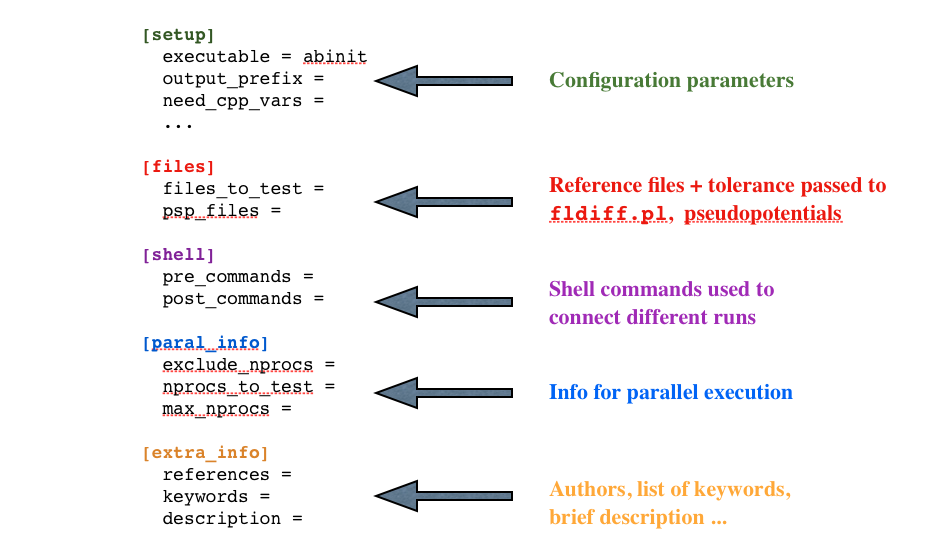
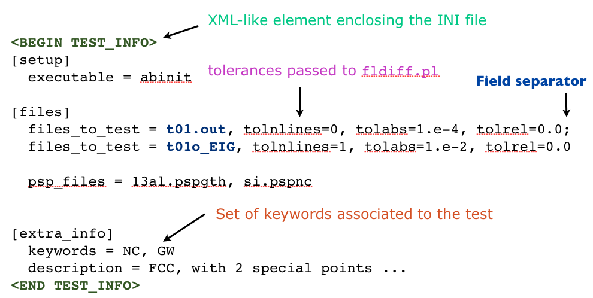

=======================
The <TEST_INFO> section
=======================

Each input file contains, in addition to the parameters passed to 
the Fortran code, an additional section (<TEST_INFO>) that provides all the 
information needed to run the test and to analyze the final results. 

The <TEST_INFO> section is placed at the end of the input file
in order to avoid problems with executables that read from standard input.
The XML-like markers <BEGIN_TEST_INFO> and <END_TEST_INFO> are used to enclose the section. 
Each line starts with the sentinel "#%%" that will be removed during the parsing. 
What is left is a standard INI configuration file that defines all the information 
neeed to run the test and to analyze the final results.

The figure below shows how options are grouped in different sections:

A simple example of TEST_INFO section is reported in the figure below:

Note that tokens are separated by a comma (e.g. tolabs=1.0, tolrel=0.0), while
fields are separated by a colon

.. hint::
    Use testlint.py to validate a new TEST_INFO section

=================
Important options
=================

This paragraph discusses in more detail the most important options present in TEST_INFO.
For the complete documentation of the options, one can execute the script tests/pymods/testsuite.py.

    - executable: 
        the name of the binary file e.g. abinit (mandatory)

    - max_nprocs: 
        the maximum number of MPI processes that can be used (mandatory)

    - pre_commands and post_commands ([shell] section)
        list of shell commands that are executed before and after running
        `executable`. At present only the commands `cp`, `mv`, and `touch` are supported.
        Since the python code uses absolute pathnames to deal with files, one has 
        to specify where the files are located
        (we cannot use relative paths as the python function os.curdir is not thread-safe).  
        i -> input directory
        p -> Psps_for_tests  
        w -> Working directory (the directory where the test is executed)
        
        ww_mv foo bar  translates into mv workdir/foo wordir/bar
        iw_cp twan.in wannier.in translates into cp Input/twan.in workdir/wannier.in 

    - keywords:
        list of keywords that can be used to select the tests.
        Note that the name of executable is always added to the list 
        of keywords, hence `runtests.py -k cut3d` run all the tests
        associated to the executable `cut3d`
